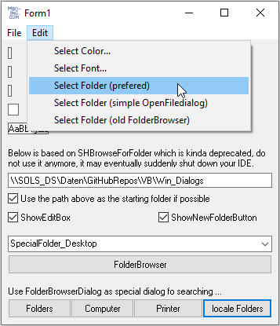

# Win_Dialogs  
## Unicode standard windows dialogs and messagebox  

 

Project started in may 2006  

contains classes for the very often used typical windows dialogs:  
* MessageBox  
* ColorDialog  
* FontDialog  
* OpenFileDialog  
* SaveFileDialog  
* OpenFolderDialog (replaces FolderBrowserDialog)  

they work mostly the same as the correspondent classes from System.Windows.Forms.  
The classes are running in VB6 (aka VBC) as well as in VBA6 or VBA7 x86 or Win64.  
You may also have a look at the tutorial: [XL_VBanywhere](https://github.com/OlimilO1402/XL_VBanywhere)  
  
Special thanks goes to [Frank Schüler](https://foren.activevb.de/community/mitglieder/details/d32526d3b730ccd55be4fb3b72de8e03/) for his great efforts on OpenFolderDialog  
    
  
  
  

