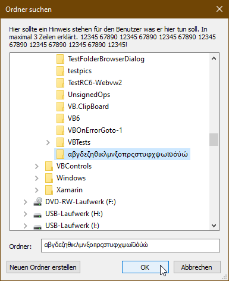

# Win_Dialogs  
## Unicode standard windows dialogs and messagebox
contains classes for the very often used typical windows dialogs:  
* MessageBox  
* ColorDialog  
* FontDialog  
* OpenFileDialog  
* SaveFileDialog  
* OpenFolderDialog (replaces FolderBrowserDialog)  

they work mostly the same as the correspondent classes from System.Windows.Forms.  
Project started in may 2006  
  
Special thanks goes to Frank Schüler for his great efforts on OpenFolderDialog  
  
  
  
  

